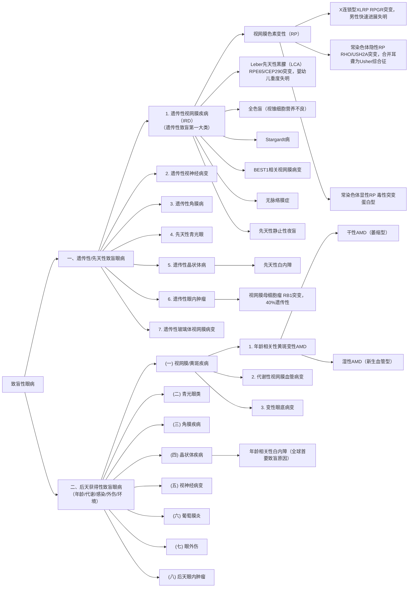

**目录：**

* content
{:toc}
# 一、致盲性眼病的分类

## （一）按照遗传性vs后天获得性分类




[致盲性眼病遗传性和后天获得性分类](https://share.mubu.com/doc/2aa4t52gQsx)

## （二）按照解剖分区分类

按照解剖分区进行分类如下：
[WHO/国际眼科理事会标准](https://cdn.who.int/media/docs/default-source/blindness-and-visual-impairment/9789241516570-eng.pdf?sfvrsn=dd15adbb_3)


```

├── 眼前段疾病
│   ├── 角膜病（感染性、营养不良、外伤性）
│   ├── 白内障（年龄相关性、先天性、代谢性）
│   └── 青光眼（原发性开角/闭角、继发性、先天性）
├── 眼后段疾病
│   ├── 视网膜血管性疾病（DR、RVO、RAO）
│   ├── 黄斑疾病（AMD、DME、高度近视黄斑病变）
│   ├── 遗传性视网膜疾病（IRD：RP、LCA、Stargardt等）
│   └── 玻璃体视网膜界面疾病（视网膜脱离、黄斑裂孔等）
├── 视神经疾病
│   ├── 青光眼性视神经病变
│   ├── 缺血性视神经病变
│   ├── 炎性/脱髓鞘性视神经病变
│   └── 遗传性视神经病变（LHON等）
├── 屈光与调节异常
│   ├── 未矫正屈光不正（近视、远视、散光、老花）
│   └── 弱视/斜视
└── 眼附属器与全身病眼部表现
    ├── 葡萄膜炎（感染/非感染性）
    ├── 眼外伤（机械性、化学性、辐射性）
    └── 眼肿瘤
```


[致盲性眼病的解剖分类](https://share.mubu.com/doc/7p-WzA3tBIx)


GWAS研究揭示的遗传图景：全基因组关联研究（你老师的讲解非常到位，点出了AMD研究的核心逻辑：从单基因病（明确靶点→基因治疗）到多基因病（复杂网络→多靶点干预）的范式转换。下面是对这段背景知识的系统梳理和补充。

---

## 一、AMD是单基因还是多基因遗传病？

**结论：AMD是典型的多基因/复杂性疾病（Multifactorial/Polygenic Disease）**，与单基因病（如你提到的Leber先天性黑朦LCA）有本质区别。

### 1. 证据链

**GWAS研究揭示的遗传图景**：全基因组关联研究（GWAS）目前已鉴定出**超过60个与AMD相关的风险位点（loci）**。最新的大规模跨种族GWAS已将这一数字更新至**63个风险位点**。

**"极端"的复杂性**：AMD在多基因病中属于"极端"类型——其遗传力（heritability）中有相当大一部分可以由少数几个强效易感变异解释，其中**补体因子H（CFH）基因和ARMS2/HTRA1基因位点（10q26）** 是两大核心风险位点。

**多基因风险评分（PRS）的预测模型**：研究显示，即使在CFH和ARMS2这两个最强风险位点上携带所有风险等位基因的人群中，**其实际AMD发病风险也因整体多基因背景不同而差异巨大**（低PRS者风险接近0，高PRS者可超过50%）。这说明AMD的发生是多基因变异的累积效应，而非单个基因的"一票否决"。

### 2. 与单基因病的本质区别

| 维度 | 单基因病（如LCA） | 多基因病（如AMD） |
|------|------------------|------------------|
| 致病基因 | 单个基因（如RPE65） | 60+个基因位点共同作用 |
| 遗传模式 | 孟德尔遗传（显/隐） | 复杂多基因遗传 |
| 治疗思路 | 修复单个基因（基因替代/编辑） | 干预疾病网络中的关键节点 |
| 环境因素影响 | 小 | **大**（年龄、吸烟、饮食等） |

**一句话总结：AMD不是"哪个基因出问题"，而是"多个基因变异+年龄/环境因素"共同推动的复杂退行性疾病。** 这决定了其治疗策略必然是**多靶点、多通路**的，而非单基因病的"一劳永逸"式基因修复。

---

## 二、AMD的临床分类：干性与湿性

这是理解后续治疗策略的基础。

| 类型 | 占比 | 核心病理 | 视力损害特点 | 治疗现状 |
|------|------|---------|------------|---------|
| **干性（萎缩型）** | 约85% | RPE细胞和光感受器慢性退变、玻璃膜疣、地图样萎缩 | 缓慢进行性中心视力下降 | **目前缺乏有效治疗** |
| **湿性（新生血管型）** | 约15% | 脉络膜新生血管（CNV）形成，渗漏、出血、水肿 | 快速严重视力下降，**导致80-90%严重视力丧失** | 抗VEGF治疗（需反复注射） |

**关键点**：虽然湿性患者占比少，但它是致盲的"主力军"。

---

## 三、抗VEGF治疗及其困境：为什么引入IL-8和补体？

### 1. 抗VEGF的局限

**黄金标准，但非完美**：玻璃体腔注射抗VEGF药物（贝伐珠单抗、雷珠单抗、阿柏西普等）是目前湿性AMD的一线治疗。但临床现实是：

- **约30%的患者**对抗VEGF单药治疗反应不佳，视力改善有限
- 许多患者随着反复注射，疗效逐渐下降，出现**继发性耐药**
- 即使初始有效者，5年后部分患者视力可能退回基线水平

**核心问题**：VEGF是CNV形成的"主力"，但不是"唯一通路"。当VEGF被阻断后，其他促血管生成和促炎通路可能被代偿性激活，形成"绕道而行"的耐药机制。

### 2. IL-8（白介素-8）为什么成为新靶点？

你老师提到西南医院团队与刘新东（董晨学生）合作研究IL-8在AMD中的作用，这与国际前沿方向一致。

**IL-8的角色**：
- **双重身份**：既是**促炎趋化因子**，也是**促血管生成因子**
- **表达来源**：由血管内皮细胞和视网膜色素上皮细胞（RPE）表达
- **与抗VEGF耐药直接相关**：研究发现，**抗VEGF治疗效果差的患者，房水中IL-8水平显著更高**。一项2024年的研究明确显示，IL-8是唯一在应答者和无应答者之间表现出显著水平差异的细胞因子，IL-6和IL-8水平与黄斑中心凹厚度呈正相关。

**遗传学证据**：IL-8基因启动子区的单核苷酸多态性（SNP）−251 A/T（rs4073）与nAMD发病和抗VEGF治疗反应相关，A等位基因携带者IL-8表达水平更高，部分研究显示其与更差的形态学治疗反应相关（尽管有研究未完全证实，但提示IL-8通路的重要性）。

**治疗思路**：既然部分患者抗VEGF效果差与IL-8高表达有关，那么**抗VEGF+抗IL-8的双靶向策略**成为合理选择。你老师说的"双抗"即指此意——同时阻断VEGF和IL-8两条促血管生成通路。

### 3. 补体系统为什么成为干/湿性AMD的共同靶点？

**遗传学最强证据**：补体系统相关基因（CFH、C3、CFB、CFI等）的变异是AMD最强的遗传风险因素。补体因子H（CFH）的Y402H突变使wAMD风险增加**1.9-2.34倍**。

**病理学证据**：
- 玻璃膜疣（AMD特征性沉积物）中可检测到补体因子**C3a、C5a、MAC**的表达
- AMD患者视网膜中**膜攻击复合体（MAC）** 水平显著升高，尤其在携带CFH变异的患者中更明显
- C5a与C5aR1结合可激活脉络膜血管内皮细胞，促进CNV形成

**补体抑制剂的现状**：针对C3、C5、MAC等靶点的补体抑制剂已进入临床试验（部分进入II/III期），但疗效仍有限，**部分药物临床效果不理想**。这提示补体系统的调控极为复杂，单一靶点阻断可能不足以逆转疾病。

**你老师的补充**：提到之前与刘勇合作的公司做补体治疗AMD——这很可能涉及**补体C5抑制剂**或**MAC形成抑制剂**方向的尝试。2025年ARVO会议上有研究展示**抗C5抗体+色素上皮衍生因子（PEDF）双靶向基因治疗产品**在干性AMD细胞模型中显示出协同保护作用，说明补体靶向治疗仍在积极探索中。

---

## 四、从机制到治疗：你老师说的"载体"和"VA"指什么？

你老师提到："IL-8这个可能也要做抗体，双抗指的是这个。也可以是设计一个VA将编码抗体的东西靶向导入。"

**这段话的理解**：

1. **双抗策略**：指同时靶向**VEGF + IL-8**（或VEGF + 补体C5）的双特异性抗体，或联合用药方案，以克服单一通路被阻断后的代偿性激活。

2. **基因递送载体（VA，即病毒载体/Vector）**：不是在眼睛局部反复注射蛋白质药物（抗体），而是用**腺相关病毒（AAV）等载体**将编码抗体的基因靶向导入眼内，让RPE细胞或光感受器细胞"自己生产"治疗性抗体蛋白。这属于**眼科基因治疗**的策略——将眼作为一个相对"免疫豁免"的器官，一次性载体注射实现长期稳定的蛋白表达。

3. **逻辑推导**：如果AMD是多基因病，无法用基因修复"根治"，但可以用**基因递送的方式实现局部持续表达治疗性蛋白**（如抗VEGF抗体、抗IL-8抗体、补体抑制蛋白等），这是目前眼科基因治疗的主流方向之一。

---

## 五、知识背景的完整拼图（供你消化后自己选择方向）

| 研究方向 | 核心逻辑 | 优势 | 挑战/现状 |
|---------|---------|------|----------|
| **抗VEGF单药** | 阻断最核心的促血管生成因子 | 临床验证充分，有效率高 | 约30%患者应答不佳；需反复注射 |
| **抗VEGF+抗IL-8双抗** | 同时阻断VEGF和IL-8两条促血管生成通路 | 针对耐药机制，有望覆盖无应答人群 | IL-8在AMD中的角色仍需更多临床验证；双抗设计和递送需优化 |
| **补体抑制剂** | 阻断补体异常激活，针对干/湿性AMD的共同上游机制 | 遗传学证据极强，可能延缓萎缩进展 | 早期临床试验效果有限，靶点选择和患者分层仍需优化 |
| **HIF抑制剂（如32-134D）** | 从上游同时抑制VEGF和ANGPTL4的表达 | Johns Hopkins研究显示与抗VEGF联用效果优于单药 | 靶向HIF可能影响其调控的数百个基因，安全性需验证 |
| **基因递送载体** | 将编码治疗性蛋白的基因导入眼内，实现长期表达 | 可减少注射频率，改善依从性 | 载体免疫原性、长期安全性、递送效率仍需优化 |

---

## 六、延伸问题与文献检索建议

**如果你想进一步了解IL-8在AMD中的研究**，可检索：
- `"interleukin-8" AND "age-related macular degeneration" AND treatment response`
- `"IL-8" AND "anti-VEGF resistance" AND neovascular AMD`

**如果想了解补体靶向治疗**：
- `"complement inhibitor" AND "geographic atrophy" AMD clinical trial`
- `"CFH" AND "AMD" AND gene therapy`

**如果关注基因递送方向**：
- `"AAV" AND "anti-VEGF" AND "wet AMD" gene therapy`

希望这份背景梳理能帮你理清思路，根据自己的兴趣在"IL-8通路"、"补体通路"和"基因递送技术"三者中选择一个切入点深入。
