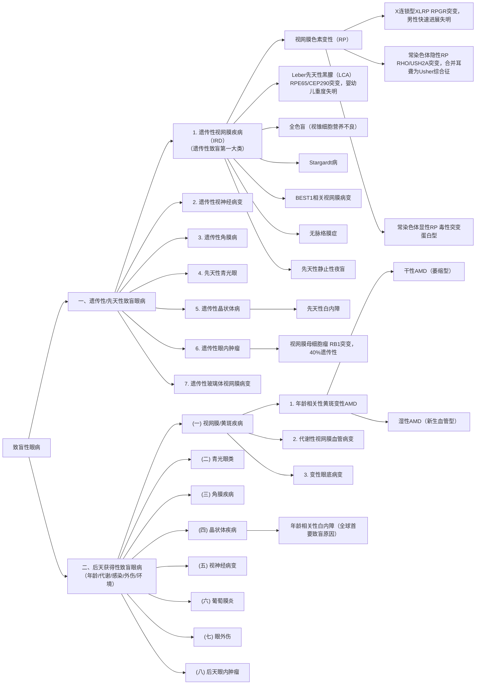

**目录：**

* content
{:toc}
# 一、致盲性眼病的分类

## （一）按照遗传性vs后天获得性分类




[致盲性眼病遗传性和后天获得性分类](https://share.mubu.com/doc/2aa4t52gQsx)

## （二）按照解剖分区分类

按照解剖分区进行分类如下：
[WHO/国际眼科理事会标准](https://cdn.who.int/media/docs/default-source/blindness-and-visual-impairment/9789241516570-eng.pdf?sfvrsn=dd15adbb_3)


```

├── 眼前段疾病
│   ├── 角膜病（感染性、营养不良、外伤性）
│   ├── 白内障（年龄相关性、先天性、代谢性）
│   └── 青光眼（原发性开角/闭角、继发性、先天性）
├── 眼后段疾病
│   ├── 视网膜血管性疾病（DR、RVO、RAO）
│   ├── 黄斑疾病（AMD、DME、高度近视黄斑病变）
│   ├── 遗传性视网膜疾病（IRD：RP、LCA、Stargardt等）
│   └── 玻璃体视网膜界面疾病（视网膜脱离、黄斑裂孔等）
├── 视神经疾病
│   ├── 青光眼性视神经病变
│   ├── 缺血性视神经病变
│   ├── 炎性/脱髓鞘性视神经病变
│   └── 遗传性视神经病变（LHON等）
├── 屈光与调节异常
│   ├── 未矫正屈光不正（近视、远视、散光、老花）
│   └── 弱视/斜视
└── 眼附属器与全身病眼部表现
    ├── 葡萄膜炎（感染/非感染性）
    ├── 眼外伤（机械性、化学性、辐射性）
    └── 眼肿瘤
```


[致盲性眼病的解剖分类](https://share.mubu.com/doc/7p-WzA3tBIx)
