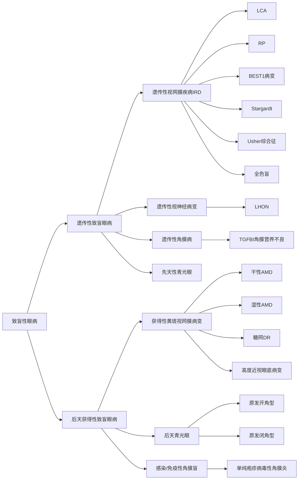

**目录：**

* content
{:toc}
### 一、致盲性眼病的分类

按照遗传性和后天获得性进行分类如下：

按照(WHO / 国际眼科理事会标准)[[https://cdn.who.int/media/docs/default-source/blindness-and-visual-impairment/9789241516570-eng.pdf?sfvrsn=dd15adbb_3](https://link.wtturl.cn/?target=https%3A%2F%2Fcdn.who.int%2Fmedia%2Fdocs%2Fdefault-source%2Fblindness-and-visual-impairment%2F9789241516570-eng.pdf%3Fsfvrsn%3Ddd15adbb_3&scene=im&aid=497858&lang=zh)World Heal..]按照解刨分区进行分类如下：

- 
